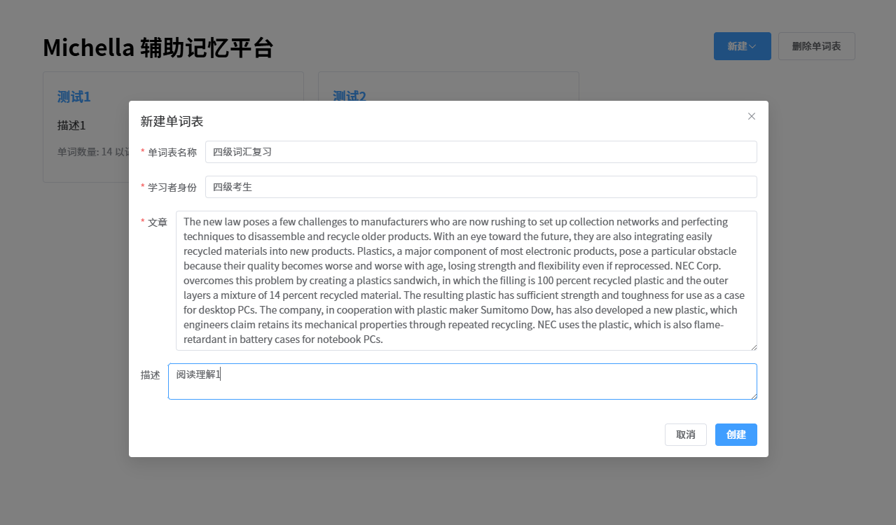
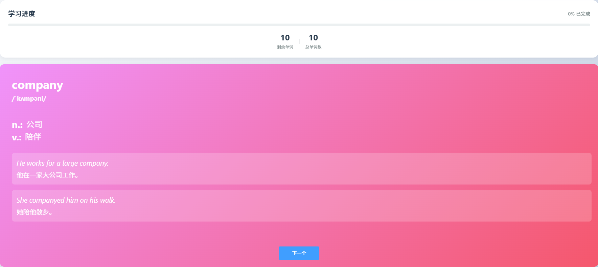
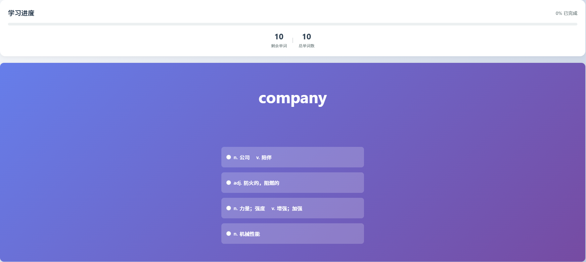
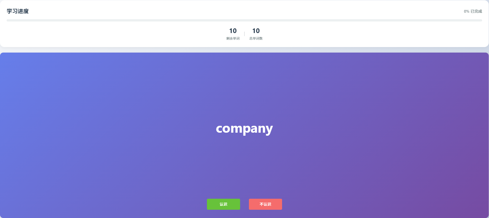
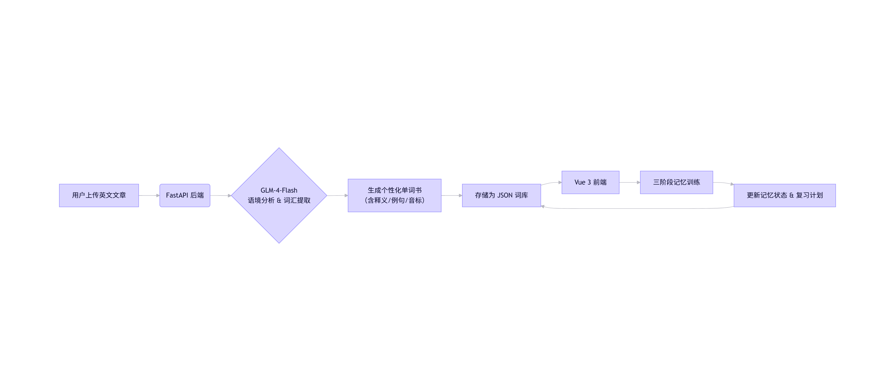

# 基于AI语境感知的重点词汇提取与个性化词库构建系统

<div align="center">
  
  [](https://vuejs.org/)
  [](https://fastapi.tiangolo.com/)
  [](LICENSE)
  [](https://glm.ziqingyang.com/)
  
</div>

## 项目简介

本项目是一个智能化英语辅助记忆平台，帮助用户从真实语境中高效提取重点词汇，并通过科学的记忆算法实现长期记忆。系统支持用户上传英文文章，自动分析内容，结合学习者身份（如高中生、CET-4/6考生、考研英语等），生成个性化单词书，并提供交互式复习流程，显著提升词汇记忆效率。

## ✨ 核心功能

### 📚 智能单词书生成

**语境感知提取**：基于文章上下文，识别高频、重点及易混淆词汇  
**身份自适应**：根据用户设定的学习目标（如"高考英语"、"雅思词汇"）动态调整词库难度与范围  
**结构化词卡**：每词包含：
- 英文单词 + 音标（IPA）
- 中文释义（多义项分列）
- 一个或多个补充例句（增强理解）

---

<div align="center">
  
  
  <p>最终生成的单词书包含单词、音标、翻译、单词每个含义的例句以及其翻译等信息</p>
</div>

### 🎯 科学记忆方法

采用三阶段渐进式记忆法，模拟人类记忆曲线：

<div align="center">
  
  
  
  
  | 阶段 | 方法 | 目标 |
  |------|------|------|
  | 识别阶段 | 4选1 | 初步认知单词含义 |
  | 回忆阶段 | 看句想词 | 强化记忆连接 |
  | 掌握阶段 | 主动输出 | 确认完全掌握 |
</div>

### 🖥️ 交互式学习体验

- **翻转卡片设计**：点击卡片查看释义，模拟实体闪卡体验
- **多题型测试**：支持选择题、填空等多种练习形式
- **流畅动效**：基于 Vue 3 的响应式交互，学习过程更沉浸

### 📊 学习数据管理

- 支持多本单词书管理
- 实时学习进度追踪
- 个人记忆状态记录

## 🛠 技术架构

### 前端（Frontend）

| 技术 | 用途 | 特点 |
|------|------|------|
| **Vue 3** | 主框架 | Composition API, 响应式系统 |
| **Element Plus** | UI组件库 | 丰富的现代化组件 |
| **Vue Router** | 路由管理 | 单页应用导航 |

### 后端（Backend）

| 技术 | 用途 | 特点 |
|------|------|------|
| **FastAPI** | Web框架 | 高性能异步支持，自动生成API文档 |
| **JSON文件** | 数据存储 | 轻量、易部署，支持后续扩展为数据库 |

### AI集成

**GLM-4-Flash** 大语言模型（智谱AI）
- 文章语义分析
- 词汇重要性评分
- 释义生成
- 例句构造

## 🏗 系统架构图

<div align="center">
  
</div>

## 🚀 快速开始

### 环境要求

- Node.js >= 16.0
- Python >= 3.8
- npm 或 yarn

### 安装步骤

1. 克隆项目代码：
```bash
git clone https://github.com/your-username/english-assisted-memory.git
```
2. 进入前端目录并启动web：
```bash
cd english-assisted-memory/web
npm run dev
```
3. 进入后端目录并启动服务：
```bash
cd ../backend
python main.py
```